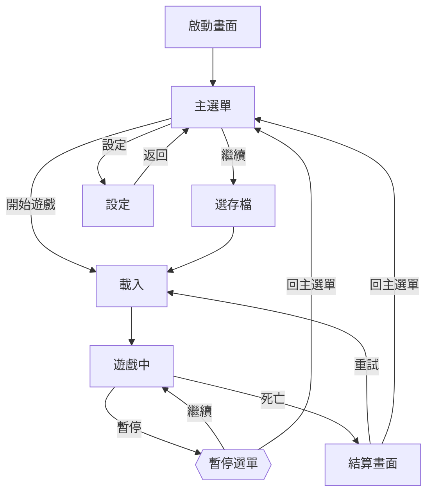

# 遊戲流程圖（畫面 / 場景流）

回答的問題：**玩家從哪裡進來、能去哪裡、怎麼回去**。做 UI 導航、場景切換、demo 動線規劃時的第一張圖。

## Mermaid 範式

語法要點：

- `flowchart TD`（上到下）適合層級感；橫向長流程用 `LR`。
- 邊上標**觸發動作**（`-->|開始遊戲|`），不標就代表自動流轉（如載入完成）。
- 覆蓋層（暫停、對話框）用不同形狀（`{{...}}`）標記——它不是「離開了遊戲場景」，畫成一般節點會誤導架構。

## 畫法要點

- **每個節點問兩題**：「怎麼進來？」「怎麼出去？」——**沒有出邊的節點就是玩家卡死的地方**（結算畫面忘了放返回鍵這種 bug，在圖上一眼可見）。
- **標出邊界情境**：遊戲中途退出會到哪？斷線 / 切後台回來會到哪？這些最常漏。
- **載入畫面畫出來**：載入是玩家體感的真實節點，藏起來會低估切換成本。
- **首次 vs 再次分流**：首次進入走教學、再次直接進主流程——分流條件標在邊上。

## 使用場景

- 企畫期：對齊「這遊戲有哪些畫面」的全貌（配 `../../../planning/game-design/`）。
- UI 實作前：每條邊就是一個要實作的轉場。
- 玩測前：把 demo 動線畫出來，確認測試者到得了要測的地方。

## 陷阱

- **把遊戲內狀態畫進來**：「戰鬥中 / 探索中」是遊戲內狀態機的事（見 `state-machine-diagram.md`），混進畫面流會讓圖爆炸。畫面流的節點是「場景 / 畫面」粒度。
- **漏掉返回路徑**：去程都畫了，回程靠腦補——返回路徑正是 UI bug 高發區。
- **一張圖畫整個遊戲**：超過 15 個節點就拆——主流程一張、每個子選單系統各一張。
