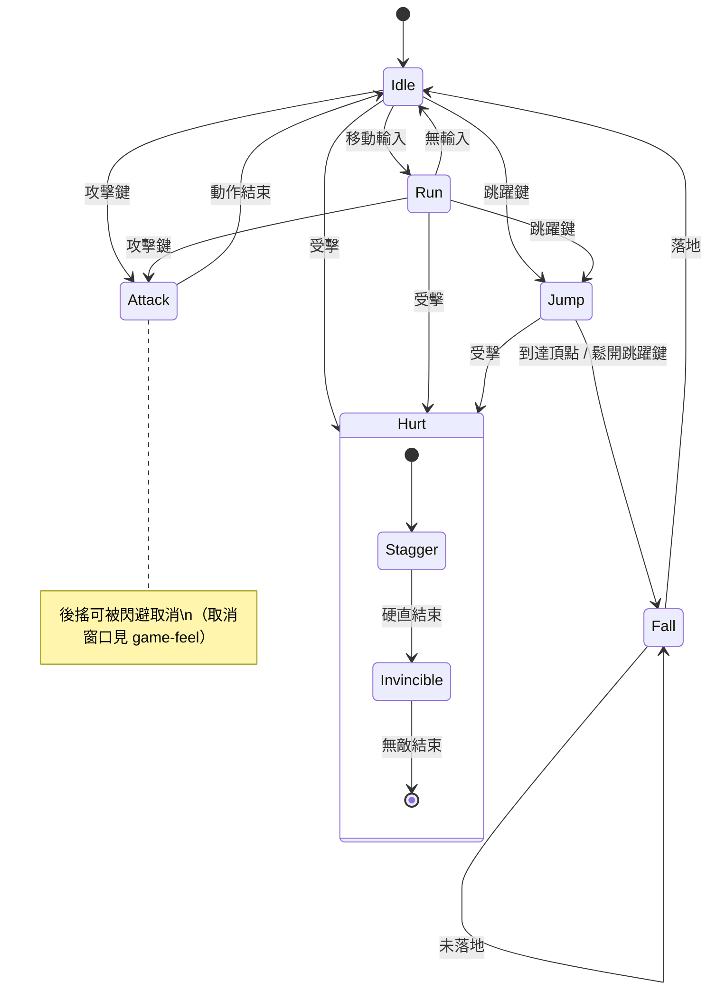

# 狀態機圖

回答的問題：**這個物件有哪些狀態、什麼條件下切換、切換時發生什麼**。角色動作、AI 行為、遊戲階段（回合制流程）都是狀態機。

## Mermaid 範式

語法要點：

- `[*]` 是入口/出口；每條轉移邊標**觸發條件**（`: 條件`）。
- 巢狀狀態（`state Hurt { ... }`）收納子流程，避免頂層爆炸。
- `note` 補充關鍵規則（取消窗口、優先權），不要塞進狀態名。

## 畫法要點

- **轉移條件必須可判定**：「覺得危險時」不是條件；「HP < 30% 且玩家在視野內」才是。畫圖時就把條件寫成可實作的判斷式，圖直接變 spec。
- **找出「從任何狀態都能進」的轉移**（受擊、死亡）：逐一畫邊會讓圖爆炸，用註記「Any State → Hurt : 受擊」約定，實作對應成全域轉移。
- **檢查孤島與死路**：進不去的狀態（沒有入邊）是死碼；出不去的狀態（沒有出邊）是卡死 bug。
- **同一觸發多個去向 = 需要優先權**：跳躍鍵在 Idle 和 Attack 中都有效嗎？誰先？在 note 中寫明優先序。

## 使用場景

- 角色控制器：實作前先畫，取消窗口與優先權在圖上吵完再寫碼（配 `../../../planning/game-design/references/feel-input-responsiveness.md`）。
- AI 行為：Patrol / Chase / Attack / Flee 的切換條件即 AI 的個性所在；debug draw 把當前狀態顯示在頭上（見 `../../../tools/game-tooling/references/debug-draw.md`）即可對圖除錯。
- 遊戲階段：回合制的階段流轉（抽牌 → 主階段 → 戰鬥 → 結束）天生是狀態機。

## 陷阱

- **狀態 vs 屬性混淆**：「中毒」通常是可疊加的屬性（flag/計時器），硬畫成狀態會組合爆炸（中毒+奔跑+跳躍 = ?）。只有**互斥**的東西才是狀態。
- **轉移條件藏在腦中**：邊上沒寫條件的狀態機圖只是泡泡圖，沒有 spec 價值。
- **一張圖畫多個機器**：角色動作機與武器狀態機是兩台機器，各畫各的，互動用事件連接、另行說明。
