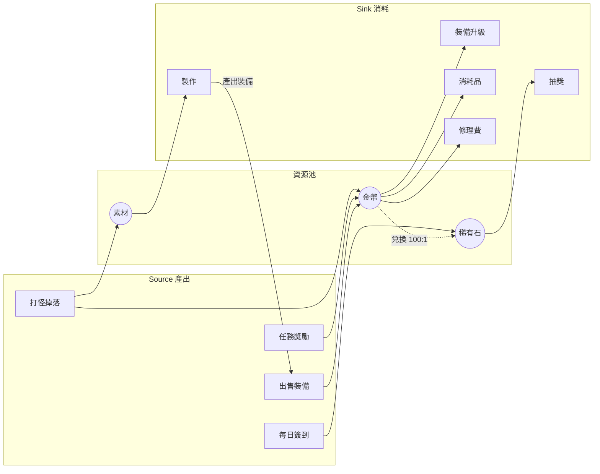

# 經濟資源流圖

回答的問題：**資源從哪來（source）、存在哪（池）、花到哪去（sink）、會不會通膨**。是 `../../game-design/references/gdd-progression-economy.md` 的 source/sink 表的視覺化版本——表格管明細，圖管結構。

## Mermaid 範式

語法要點：

- 三個 `subgraph`：Source → 池 → Sink，左到右一眼看懂流向。
- 資源池用 `((...))` 圓形，與行為節點區隔。
- 兌換關係用虛線並**標匯率**（`-.->|兌換 100:1|`）——兌換邊決定「幾個池其實是一個池」。
- 循環（製作 → 出售 → 金幣）畫出來，它是刷錢漏洞的高發地。

## 畫法要點

- **逐池檢查進出平衡**：每個池數一數入邊與出邊。**只有入邊沒有出邊（或 sink 全是一次性）= 通膨預定**；只有出邊 = 這資源存在的意義是什麼？
- **標注節奏**：邊上可加頻率（每日上限、週限、一次性），高頻 source 對低頻 sink 就是失衡的形狀。
- **循環要人工走一遍**：任何「產出 → 轉換 → 回到產出」的環，帶匯率算一圈——若一圈下來資源變多，就是無限刷錢機。
- **主動 sink 標記出來**：玩家「想要」的 sink（新裝備）與「被迫」的 sink（修理費）用不同色/形狀標，主動 sink 太少的圖，玩家攢錢沒動力。

## 使用場景

- 企畫期：把 progression-and-economy 的 source/sink 表畫成圖，結構問題（孤立池、無限環）在圖上比表上明顯。
- 加新系統前：新資源 / 新商店接進圖裡，先看它動了哪些既有平衡。
- 經濟出事時：對照 `../../game-tooling/references/debug-logging.md` 的經濟事件日誌，在圖上標紅失衡的邊。

## 陷阱

- **畫了不算**：圖只呈現結構，數值平衡還是要試算表模擬（見 progression-and-economy 的試算表先行）——圖與表互補，別拿圖當平衡證明。
- **漏掉隱形 source/sink**：首儲雙倍、活動加成、賽季重置——不畫進圖的例外，就是日後失衡查不到的原因。
- **一張圖畫所有貨幣**：超過三種資源全塞一張會糊；主經濟一張，特殊貨幣（賽季幣、活動幣）各自小圖。
