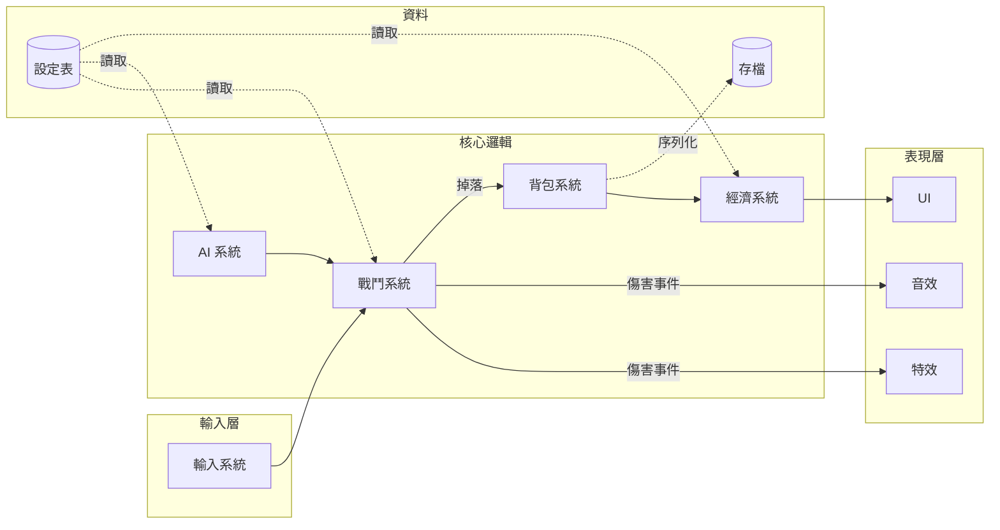

# 系統關係圖

回答的問題：**系統之間誰依賴誰、資料往哪個方向流**。架構討論、交接、以及「這改動會炸到誰」的影響分析用圖。

## Mermaid 範式

語法要點：

- `flowchart LR`（左到右）自然呈現「輸入 → 邏輯 → 表現」的流向。
- `subgraph` 分層（輸入 / 核心 / 資料 / 表現），層的邊界就是架構紀律。
- 實線箭頭 = 依賴 / 呼叫方向；虛線（`-.->`）= 資料讀寫。箭頭語意在圖說中寫死，全圖一致。
- 資料節點用 `[(...)]` 圓柱形。

## 畫法要點

- **箭頭方向 = 依賴方向，一以貫之**：A → B 表示「A 知道 B」。畫完檢查：**表現層不應有箭頭指向核心邏輯**（UI 不該改戰鬥資料）；有，就是要修的架構問題——圖的價值就在讓這種箭頭現形。
- **找雙向箭頭**：A ↔ B 表示互相依賴，是耦合警訊。問：能不能改成單向 + 事件回流（配 `../../game-architecture/references/data-separation.md` 的決策與執行分離）？
- **數入邊**：入邊最多的節點是「所有人都依賴的東西」——它一改全部重測。刻意讓它穩定（通常應該是純資料或介面）。
- **畫「事件」與畫「呼叫」分開標**：直接呼叫是強耦合、事件是弱耦合，同一種箭頭畫兩者會讓架構看起來比實際乾淨。

## 使用場景

- 動工前：新系統要接進來，先畫它的入邊出邊，接口在圖上談妥。
- 交接 / onboarding：一張分層關係圖勝過一小時口頭導覽。
- 重構決策：把現況畫出來（誠實畫，包括醜的雙向箭頭），要改什麼一目了然。

## 陷阱

- **畫理想不畫現實**：架構圖畫的是「希望的樣子」，程式碼是另一回事——圖要標註「現況」或「目標」，兩張分開畫。
- **粒度失控**：類別級的圖沒人看得完；以「系統/模組」為節點（10±5 個），細節放大另畫。
- **沒有圖例**：實線虛線、箭頭方向的語意沒寫，每個讀者各自腦補——圖例三行，永遠要有。
